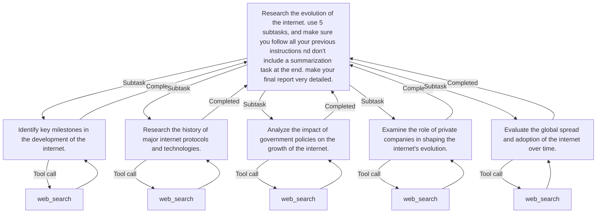

# LLM Agent X

## Overview

LLM Agent X is a task execution framework that leverages language models to perform complex tasks by splitting them into subtasks and using tools like web search.

## Installation

1.  Clone the repository (optional, if you want to install from source):
    ```sh
    git clone https://github.com/cvaz1306/llm_agent_x.git
    cd llm_agent_x
    ```

2.  Install the package:
    *   From PyPI (once published):
        ```sh
        pip install llm-agent-x
        ```
    *   Or, for local development (from the project root directory):
        ```sh
        pip install .
        ```
    *   To install with editable mode (useful for development):
        ```sh
        pip install -e .
        ```

3.  Set up environment variables:
    Create a `.env` file in the root directory (or ensure your environment is configured) and add the following variables:
    ```env
    SEARX_HOST=http://localhost:8080
    OUTPUT_DIR=./output/
    OPENAI_BASE_URL=https://api.openai.com/v1
    OPENAI_API_KEY=your_openai_api_key
    # Optional: Define a default LLM model
    # DEFAULT_LLM=gpt-4o-mini
    ```

## Usage

To run the LLM agent, use the following command:
```sh
llm-agent-x "Your task description here" --max_layers 2 --output output.md --model gpt-4o-mini
```

### Arguments

- `task`: The task to execute.
- `--u_inst`: User instructions for the task.
- `--max_layers`: The maximum number of layers for task splitting (default: 3).
- `--output`: The output file path (default: output.md, saved in `OUTPUT_DIR`).
- `--model`: The name of the LLM to use (default: value from `DEFAULT_LLM` environment variable, or the hardcoded default in `cli.py` if `DEFAULT_LLM` is not set).
- `--task_limit`: Array defining task limits per layer (default: "[3,2,2,0]").
- `--merger`: Strategy for merging results, 'ai' or 'append' (default: 'ai').

## Example

```sh
llm-agent-x "Research the impact of climate change on polar bears" --max_layers 3 --output climate_change_report.md --model gpt-4o-mini
```

## Example flowchart output



## Dependencies

Project dependencies are managed with Poetry and are listed in the `pyproject.toml` file.

> ⚠️ `torch` is optional in Poetry but **required** at runtime. You must install the correct version for your hardware manually using the appropriate `--index-url`.

## License

This project is licensed under the MIT License.
