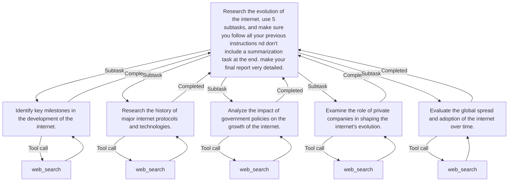

# LLM Agent X

## Overview

LLM Agent X is a task execution framework that leverages language models to perform complex tasks by splitting them into subtasks and using tools like web search.

## Installation

1. Clone the repository:
    ```sh
    git clone https://github.com/yourusername/llm_agent_x.git
    cd llm_agent_x
    ```

2. Install the required dependencies:
    ```sh
    pip install -r requirements.txt
    ```

3. Set up environment variables:
    Create a `.env` file in the root directory and add the following variables:
    ```env
    SEARX_HOST=http://localhost:8080
    OUTPUT_DIR=./output/
    OPENAI_BASE_URL=https://api.openai.com/v1
    OPENAI_API_KEY=your_openai_api_key
    ```

## Usage

To run the LLM agent, use the following command:
```sh
python test.py "Your task description here" --max_layers 2 --output output.md --model qwen2.5-coder-long:latest
```

### Arguments

- `task`: The task to execute.
- `--max_layers`: The maximum number of layers for task splitting (default: 2).
- `--output`: The output file path (default: output.md).
- `--model`: The name of the LLM to use (default: value from `DEFAULT_LLM` environment variable).

## Example

```sh
python test.py "Research the impact of climate change on polar bears" --max_layers 3 --output climate_change_report.md --model gpt-3.5-turbo
```

## Example flowchart output



## Dependencies

- `pydantic`
- `langchain_core`
- `langchain_openai`
- `langchain_community`
- `icecream`
- `python-dotenv`
- `pathlib`

## License

This project is licensed under the MIT License.
